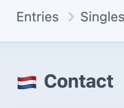

# CP Site Icons plugin for Craft CMS 3.x

Display site icon when editing entries, to be able to distinguish between different sites.



## Requirements

This plugin requires Craft CMS 3.0.0-beta.23 or later.

## Installation

To install the plugin, follow these instructions.

1. Open your terminal and go to your Craft project:

        cd /path/to/project

2. Then tell Composer to load the plugin:

        composer require nthmedia/cp-site-icons

3. In the Control Panel, go to Settings → Plugins and click the “Install” button for CP Site Icons.

4. You can choose if you want the site handle or site language as key to distinguish your sites. This key is also the key of the icons array in the config:

5a. Create `/config/cp-site-icons.php` and add your configuration, for example:
```
<?php

return [
   'icons' => [
      'de' => '🇩🇪',
      'de-AT' => '🇦🇹',
      'en' => '🇬🇧',
      'es' => '🇪🇸',
      'fr' => '🇫🇷',
      'it' => '🇮🇹',
      'nl' => '🇳🇱',
      'nl-BE' => '🇧🇪',
   ],
];
```

5b. You can also use handles and/or custom CSS properties:

```
<?php

return [
   'icons' => [
      'siteA' => [
         'background' => 'url(/favicon/favicon-32x32.png)',
         'background-size' => 'cover',
         'content' =>  '""',
      ],
];
```

## Credits

- Brought to you by [NTH media](https://nthmedia.nl)
- Based on a code snippet of [Dennis Frank](https://github.com/dennisfrank), shared at DotAll 2021.
