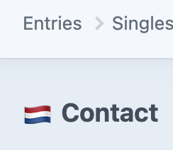

# CP Site Icons plugin for Craft CMS

Display site icon when editing entries, to be able to distinguish between different sites.



## Requirements

This plugin requires Craft CMS 5.

## Installation

To install the plugin, follow these instructions.

1. Open your terminal and go to your Craft project:

        cd /path/to/project

2. Then tell Composer to load the plugin:

        composer require nthmedia/cp-site-icons

3. In the Control Panel, go to Settings → Plugins and click the "Install" button for CP Site Icons. Or enable it through the command line:
    
        ./craft plugin/install cp-site-icons

4. You can choose if you want the site handle or site language as key to distinguish your sites. This key is also the key of the icons array in the config.

5. Create `/config/cp-site-icons.php` and add your configuration.

## Configuration

### Basic example with emoji flags

```php
<?php

return [
    'icons' => [
        'de' => '🇩🇪',
        'de-AT' => '🇦🇹',
        'en' => '🇬🇧',
        'es' => '🇪🇸',
        'fr' => '🇫🇷',
        'it' => '🇮🇹',
        'nl' => '🇳🇱',
        'nl-BE' => '🇧🇪',
    ],
];
```

### Custom CSS properties

You can also use handles and/or custom CSS properties:

```php
<?php

return [
    'icons' => [
        'siteA' => [
            'background' => 'url(/favicon/favicon-32x32.png)',
            'background-size' => 'cover',
            'content' => '""',
        ],
    ],
];
```

### Position

By default, icons are shown on the **page title** when editing entries. Since version 3.1.0, you can also replace the globe icon in the **breadcrumb** bar with a site icon.

Use the `position` option to control where icons appear:

```php
<?php

return [
    // Show icon in the breadcrumb only
    'position' => ['breadcrumbIcon'],

    // Show icon on the page title only (default)
    'position' => ['pageTitle'],

    // Show icon in both locations
    'position' => ['breadcrumbIcon', 'pageTitle'],

    'icons' => [
        'en' => '🇬🇧',
        'nl' => '🇳🇱',
    ],
];
```

When `position` is omitted, it defaults to `['pageTitle']` for backwards compatibility.

## Credits

- Brought to you by [NTH media](https://nthmedia.nl)
- Based on a code snippet of [Dennis Frank](https://github.com/dennisfrank), shared at DotAll 2021.
